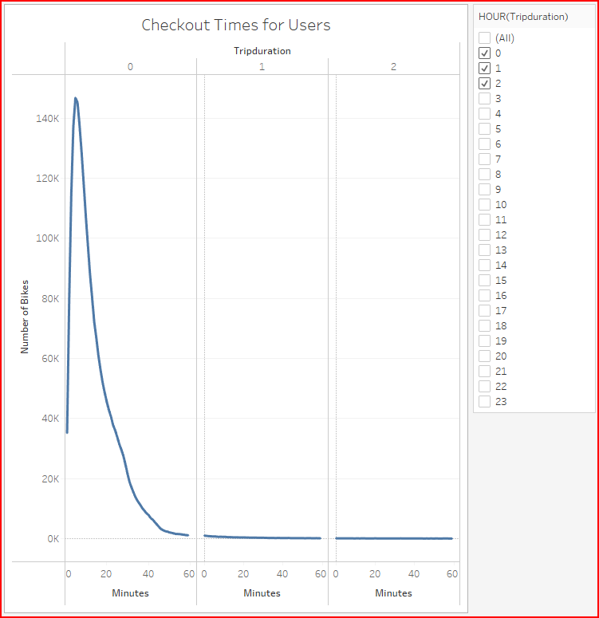
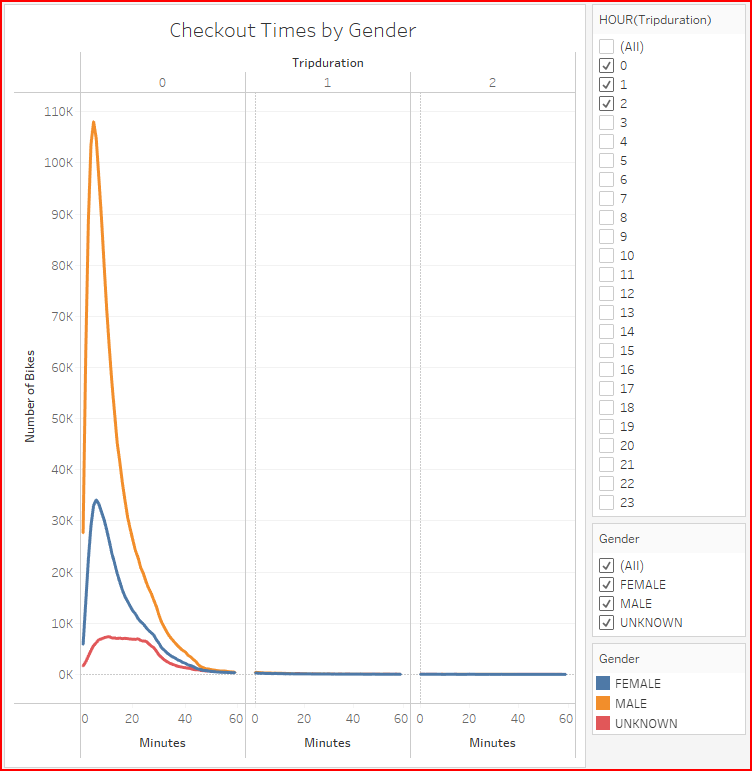
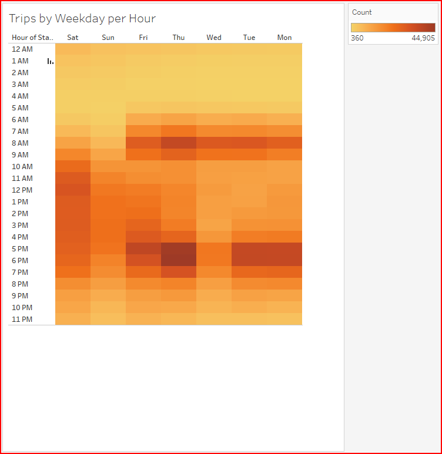
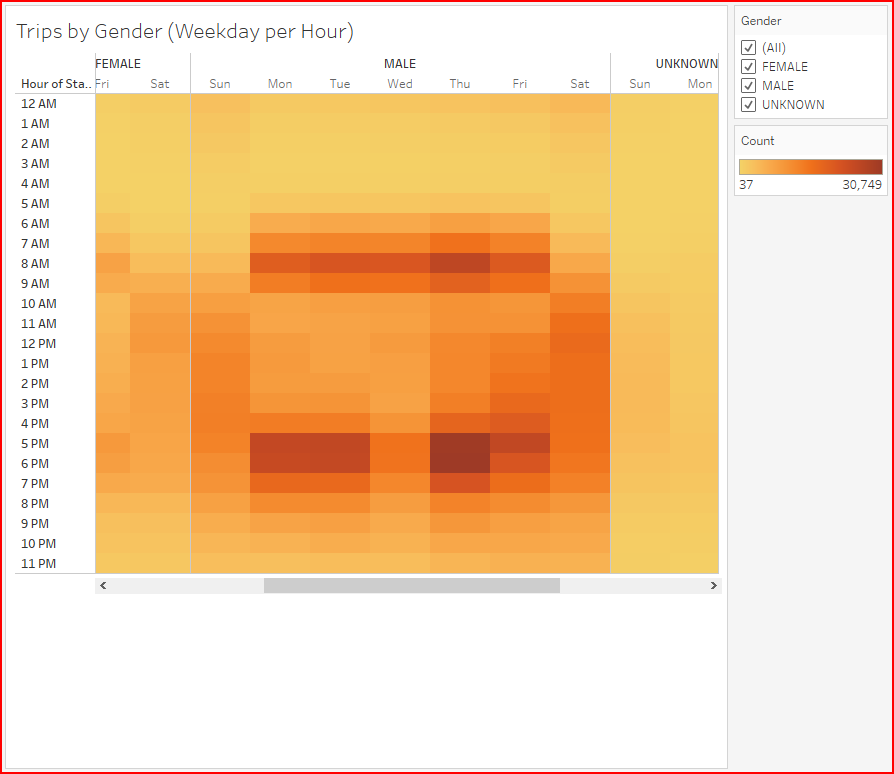
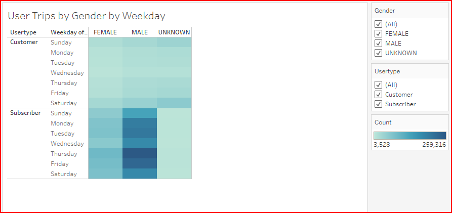
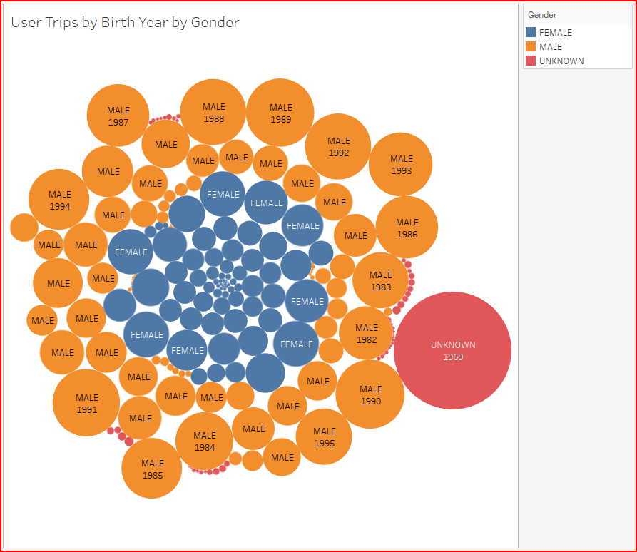
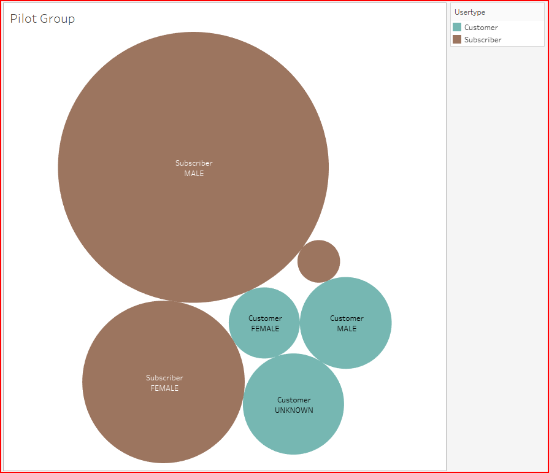

<<<<<<< HEAD
# Bike Sharing Analysis

## Project Overview

Two friends have recently returned from a trip to New York and throughly enjoyed their experiences exploring the city. The primary reason for their successful vacation experiences was their reliance on citi bike-sharing service for their daily trips and destination adventures. By using this service, it gave them the time and opportunity to interact with people who live there and use bikes regularly for their commute and also allowed them to get to know the city on a very personal level.

As they return home to Des Moines, they have decided to explore the possibility of creating a business venture with a similar bike sharing service to see if they can capture this same appeal in their local community. Thankfully, they have a successful service and personal experience with citi bikes which they can study to determine if a similar local service can be sustainable and successful.

With this task in mind, we are asked to retrieve more information from the citi bike sharing service in New York City, which is publically available, and prepare visualizations that can be presented to potential investors. A determination needs to be made as to the viability of the data in Des Moines as it relates to New York City and we need to ensure that the integrity of the presented visualizations are valid for our local community. The core issue we need to think about is what we absolutely need to know in order to create our bike-sharing program in Des Moines. We have cultivated a number of potential investors who have agreed to an in-person pitch. So we are now tasked with creating suitable visualizations and framing a bike sharing business venture that investors will want to support and invest in locally. We will make a comparative analysis and provide information and charts with the results we have found in the NYC ride sharing data.

- Deliverables:
  1. Using Python, update the CSV bike trips CSV file.
  2. Create 5 different visualizations in Tableau
  3. Create 2 additional custom visualizations
  4. Craft a Tableau Story based on the visualizations
  5. Written Analysis
------------------------------------------------------------------------------------------------------------

## Resources
- Software: Visual Studio Code 1.56.2, Python 3.7.10, jupyter Notebook Server 6.3.0
- Browser : Google Chrome v91.0.4472.124 
- Data Source: https://s3.amazonaws.com/tripdata/index.html#:~:text=ZIP%20file-,201908-citibike-tripdata.csv.zip,-Sep%2018th%202019

------------------------------------------------------------------------------------------------------------

## Results

[link to dashboard](https://public.tableau.com/app/profile/barney.bullock/viz/Challenge14v2/CitiBikeStory?publish=yes)

### Trip Duration
- The peak trip duration is usually seen to be between 5 and 6 minutes. This means citi bike clients are using the service for very short term travel as shown below.

### Trip Duration by Gender
- Further breaking down the trip duration by gender, we see that males use the bike sharing service predominantly more for trips of 5 minutes.

### Breakdown by Day Usage
- The bike sharing service usage peaks at the following periods:
  - 7AM - 9AM Monday to Friday
  - 5PM - 7PM Monday to Friday
  - 10AM - 6PM Saturdays
  - 12AM - 5PM Sundays
- This breakdown indicates that bikes are used for commuting to and from work on weekdays and also used on weekends for leisure or tourist destinations.

### Breakdown by Day and Gender Usage
- The above peak times are further qualified by the image below that shows all genders using the service in a similar fashion. However, male usage is 2 to 4 times more pronounced within those peak times.

### Breakdown by Usertype and Gender/Weekday Usage
- Further refinement of the bike sharing usage brings us to the visualization below that shows subscribers as the primary users of the service versus walk in customers. Male subscribers again making upfor the majority of users throughout the week.

### Trips taken by Birth Year and Gender
- The age group of all users that have the most imapct on bike trips is from 24-40 year olds. Also, we see a big jump in usage for users that turn 50 years old.

### Potential Pilot Group
- Based on the image below we can see how important subscribers are to the bike sharing service. Female subscribers show 5 times more usage than walk up clients and for males its 10 to one.

------------------------------------------------------------------------------------------------------------

## Overall Summary
- The downtown area of Des Moines with 
=======
# bikesharing
bike sharing analysis
>>>>>>> parent of 3ceeb14 (Updating readme analysis)
